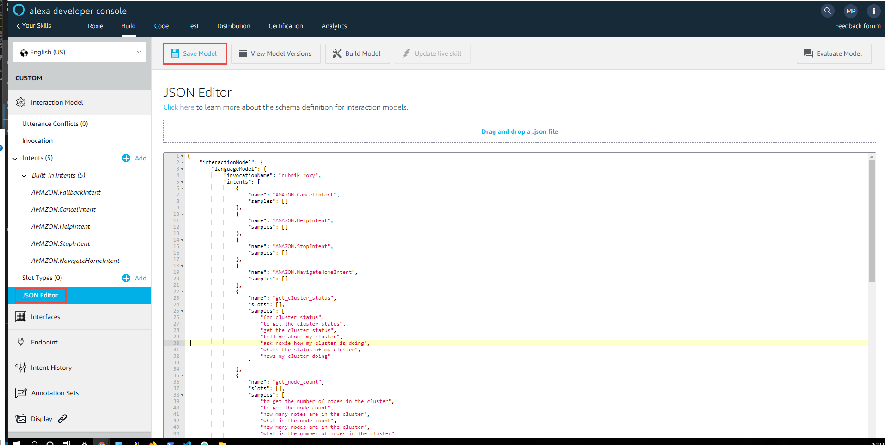
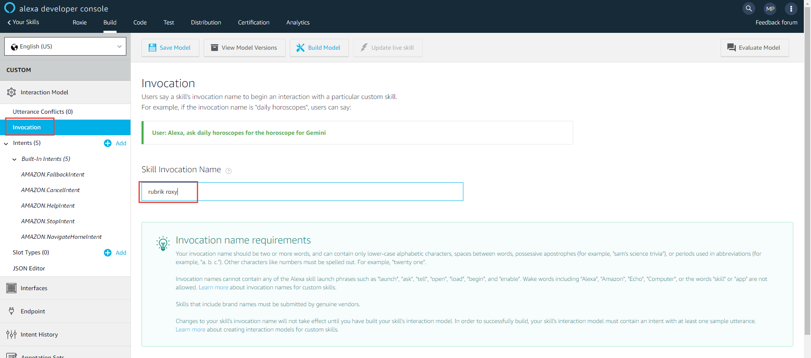

# Creating a Roxie Alexa Skill

# Table of Contents

# Introduction to the Roxie Alexa Skill

Since Alexa Skills Kit (ASK) utilizes Lex in order to determine and power intents for skills, porting Roxie to an Alexa skill is a fairly simple process. This guide will walk through the steps that need to be performed in order to export/import the Lex intents, create the wrapper Lambda function, and publish the Alexa skill to a subset of beta users. Requirements and configuration may change depending on decisions to publicly publish a skill within the Alexa Skills or the Alexa for Business directories.

Even though Alexa is powered by Lex, there are a number of limitations and differentiations as to how we set up the skill. For example, while Lex allows us to configure an endpoint (Lambda function) per intent, Alexa only supports one endpoint total. For this reason we need to build a wrapper Lambda function to act as our endpoint which will in turn call the individual Roxie Lambda functions within the Roxie use-case.  

The end to end workflow is as follows:

1. A users asks a question to Roxie via the Alexa skill invocation keyword.
1. Alexa Skills Kit (ASK) translates the utterances or spoken words to a given intent.
1. The intent request is sent to the wrapper Lambda function (ASK endpoint) for processing.
1. The wrapper Lambda function processes the intent name, calling the associated individual Lambda function within the Roxie use-case to fulfil the intent.
1. The individual function contains code used to query the Rubrik API and find an answer to our question.
1. The Rubrik API responds to the query and to the individual Lambda function. The function code then formats the message into something a bit more human friendly.
1. The friendly message is handed back to the wrapper Lambda function, where it is then further modified into a format which the Alexa Skill can read and sent to back to the Alexa Skills Kit.
1. The Alexa skill then returns the response to the user via spoken word.

# Prerequisites

The following are the prerequisites required in order to create and test the Roxie Alexa Skill

* Installation and configuration of a function Roxie Chatbot
* Access to the Alexa Developer Portal
* An Amazon Echo, Echo Dot, or Alexa supported device registered to an Amazon account

# Configuration

The following outlines the configuration process of creating an Alexa Skill around the Roxie use-case.

## Create an Alexa Skill

1. Log into the [Alexa Developer Console](https://developer.amazon.com/alexa/console/ask) and click `Create Skill` to create a new skill. Give the skill your desired name, selecting `Custom` as a model, and `Provision your own` for backend hosting. When finished, click `Create Skill`.

1. From the template selection screen, select `Start from scratch` and click `Choose`.

1. From the left hand navigational menu, select `Interaction Model` -> `Intents` -> `JSON Editor`. Drag and drop [this file](ask/intents.json) containing the Roxie intents into the JSON editor and click `Save Model`

**Note - The names of the intents must be an exact match with the names of the individual Lambda functions setup within your Roxie bot. The wrapper function created later will execute these individual functions based on the intent name. For example, if you have an intent named *get_cluster_status* an associated Lambda function must exist named *get_cluster_status*.**

1. From the left hand navigation within the build section, select `Interaction Model` -> `Invocation`. Here we need to define an invocation name for our skill. This will be the words spoken to Alexa to invoke our skill (IE Alexa, Open Rubrik Roxy). By default, `rubrik roxy` will be used from the imported JSON in the previous step however feel free to modify this to your preference. *Note - if using roxy it must be spelt with a 'y' in order for Alexa to understand the pronunciation of the word.*

With our intents and invocation configured, we can now begin to create the wrapper lambda function.  

## Modify IAM service role used by Roxie

## Create a wrapper Lambda Function

1. Head into Lambda and select 'Create function'.
1. Select 'Author from scratch'  Give the function a name and ensure that Python 3.6 is selected for the runtime.
1. Under permissions, select to use an existing role, selecting the same role as that used within the Roxie use-case.
***NOTE*** In order to give the wrapper function permissions to execute the other lambda functions the AWSLambdaRole must be added to the existing service role.
1. Within the designer section, select to add a new trigger. Select the Alexa Skills Kit trigger.  Leave Skill ID verification checked and input the skill id of the newly created Alexa Skill ( This can be obtained by selecting 'Show Skill ID' on the listing of skills created within the Alexa Developer Console.
1. Copy the code from this file to the inline editor within the function

## Associate wrapper Lambda function ARN with Alexa Skill

1. Within the wrapper Lambda function previously created, select the ARN located in the ?????
1. From the left hand navigational menu, select Endpoint.  Select Amazon Lambda ARN as the endpoint type, and paste the previously copied ARN into the Default Endpoint section, and click 'Save Endpoints'
1. Select Intents from the Left hand navigational menu, then click 'Build Model'

## Testing the Alexa Skill before publishing

1. Select 'Test' to begin testing our skill.  Select Development from the dropdown above.  We can now begin to test our intents by sending input into the testing input box. IE Ask Rubrik Roxy how my cluster is doing should run the get_cluster_status function and return content.

## Publish the Alexa skill and associate beta user(s)

Once all functions and intents are working properly we can publish and invite users to test our skill.

1. Select the distribution tab and fill out the required fields (Short/Long Description) ICONS, category
1. Answer all the questions.
1. Go to the end and do the validation - it may not end.  Doesn't matter, go back to distribution and follow the prompts until you get to the beta test part.  Enable the beta test and input the emails of associated Amazon accounts with devices you want to test on.  Get the email, enable the skill in your account - boom